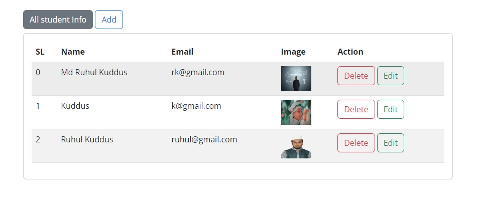

## CRUD PHP with File Operation
<blockquote>
 This Simple crud operation with php and here include file operation
</blockquote>

## Features of Inventory Management System
<ul>
    <li>CRUD Operation</li>
    <li>Image upload and Update</li>
    <li>Registration info add and update</li>
    <li>Delete Confirmation</li>

</ul>

## Technology
<ul>
    <li>PHP</li>
    <li>MySQL</li>
    <li>JavaScript</li>
    <li>HTML</li>
    <li>CSS</li>
    <li>Bootstrap</li>
</ul>

## ScreenShot of this project
## Add Info Page
<table>
    <thead>
        <tr>
            <th>
                
            </th>
        </tr>
    </thead>
</table>

## Info List Page
<table>
    <thead>
        <tr>
            <th>
                
            </th>
        </tr>
    </thead>
</table>
